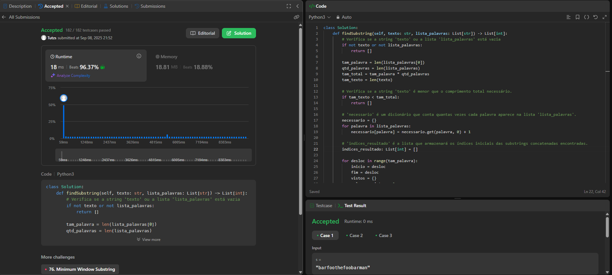

## Alunos  
| Matrícula | Nome |  
|-----------------------|---------------------|  
| 22/1007958 | Cláudio Henrique dos Santos Carvalho |  
| 22/1022462 | Arthur da Silveira Sousa |

## Descrição do projeto

Questões resolvidas do LeetCode sobre Algoritmos de Busca da disciplina de Estrutura de Dados 2.

### Questões

|Questão | Dificuldade | Autor|
| -- | -- | -- |
| [4. Median of Two Sorted Arrays](https://leetcode.com/problems/median-of-two-sorted-arrays/description)| Difícil | Cláudio|
| [23. Merge k Sorted Lists](https://leetcode.com/problems/merge-k-sorted-lists/)| Difícil | Arthur|
| [30. Substring with Concatenation of All Words](https://leetcode.com/problems/substring-with-concatenation-of-all-words/description/)| Difícil | Arthur|
| [410. Split Array Largest Sum](https://leetcode.com/problems/split-array-largest-sum/description)| Difícil | Cláudio|
| [114. Flatten Binary Tree to Linked List](https://leetcode.com/problems/flatten-binary-tree-to-linked-list/description)| Médio| Cláudio|

## Guia de instalação
Basta executar os scripts python que estão na pasta de questões de cada aluno.

## Capturas de tela

#### Cláudio

### [4. Median of Two Sorted Arrays](https://leetcode.com/problems/median-of-two-sorted-arrays/description)

### [410. Split Array Largest Sum](https://leetcode.com/problems/split-array-largest-sum/description)

### [114. Flatten Binary Tree to Linked List](https://leetcode.com/problems/flatten-binary-tree-to-linked-list/description)

#### Arthur

### [23. Merge k Sorted Lists](https://leetcode.com/problems/merge-k-sorted-lists/)

### [30. Substring with Concatenation of All Words](https://leetcode.com/problems/merge-k-sorted-lists/)

## Gravação

[Link do vídeo aqui - Cláudio Henrique](https://www.youtube.com/watch?v=I0YphfFqMPU)
[Link do vídeo aqui - Arthur Sousa](https://youtu.be/R8tEg9uwN_M)

## Conclusões
Cláudio: Nas minhas questões utilizei o algoritmo de busca binária para duas questões dificeis, e um algoritmo de busca em árvore para resolver uma questão de dificuldade média.
Arthur: Utilizei tabela hash e a técnica chamada *sliding window* em um exercício e no outro utilizei o método **dividir e conquistar**.