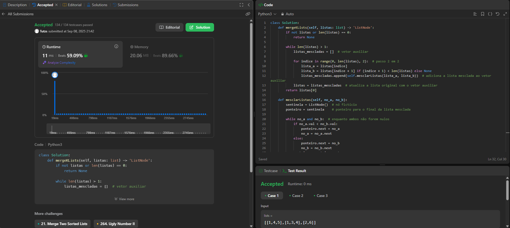

## Alunos  
| Matrícula | Nome |  
|-----------------------|---------------------|  
| 22/1007958 | Cláudio Henrique dos Santos Carvalho |  
| 22/1022462 | Arthur da Silveira Sousa |

## Descrição do projeto

Realizamos os exercícios 4, 23, 30, 114, 410 

## Guia de instalação
Fizemos em Python

## Capturas de tela

Exercício 01 - Difícil - 23. Merge k Sorted Lists

Exercício 02 - Difícil - 30. Substring with Concatenation of All Words

Neste tópico você deve adicionar imagens do funcionamento do projeto.  
 - As imagens devem ser salvas no repositório.
 - Imagens salvas em domínios eternos tendem a ficar indisponíveis e devem ser evitadas. 
  
## Conclusões
Cláudio: Nas minhas questões utilizei o algoritmo de busca binária para duas questões dificeis, e um algoritmo de busca em árvore para resolver uma questão de dificuldade média.
Arthur: Utilizei tabela hash e a técnica chamada *sliding windown* em um exercício e no outro utilizei o método **dividir e conquistar**.